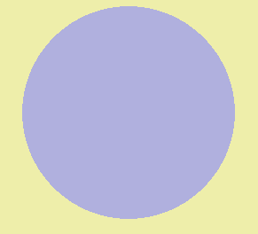

 # pygame_samples
 ## ステップ2

 ### demo_01.py
 ウィンドウサイズ
 >~~~
 >screen = pygame.display.set_mode([640, 480])
 >~~~

 ウィンドウの色
 >~~~
 >screen.fill((238, 238, 170))
 >~~~

 タイトルバー
 >~~~
 >pygame.display.set_caption("pygame demo - window title here")
 >~~~

 円の色と位置と大きさ(大きい方)
 >~~~
 >pygame.draw.circle(screen, (176, 176, 222), (320, 240), 120)
 >~~~

 円の色と位置と大きさ(小さい方)
 >~~~
 >pygame.draw.circle(screen, (222, 176, 222), (120, 120), 20)
 >~~~

 >~~~
 >pygame.draw.circle(screen, (222, 176, 222), (120, 120), 20)
 >~~~

 長方形の色と位置と大きさ
 >~~~
 >pygame.draw.rect(screen, (120, 120, 120), Rect(120, 120, 200, 120))
 >~~~

 動く点のそれぞれの色
 >~~~
 >color_on = (240, 120, 120)
 >color_off = (120, 120, 120)
 >~~~

 動く点の縦の範囲
 >~~~
 >for y0 in range(7):
 >~~~

 動く点の横の範囲
 >~~~
 >for x0 in range(5):
 >~~~

 ## ステップ3

 ### demo_01.py
 x座標を1ずつ増やす
 >~~~
 >x1 += 1
 >~~~

 x座標が4になったとき0にする
 >~~~
 >if x1 > 4:
 >x1 = 0
 >~~~

 y座標を1ずつ増やす
 >~~~
 >y1 +=1
 >~~~

https://git-lfs.github.com/<video controls src="画面録画 2025-01-27 165408-1.mp4" title="Title"></video>

