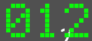

 # pygame_samples
 ## ステップ2

 ### demo_01.py
 ウィンドウサイズ
 >~~~
 >screen = pygame.display.set_mode([640, 480])
 >~~~

 ウィンドウの色
 >~~~
 >screen.fill((238, 238, 170))
 >~~~

 タイトルバー
 >~~~
 >pygame.display.set_caption("pygame demo - window title here")
 >~~~

 円の色と位置と大きさ(大きい方)
 >~~~
 >pygame.draw.circle(screen, (176, 176, 222), (320, 240), 120)
 >~~~

 円の色と位置と大きさ(小さい方)
 >~~~
 >pygame.draw.circle(screen, (222, 176, 222), (120, 120), 20)
 >~~~

 >~~~
 >pygame.draw.circle(screen, (222, 176, 222), (120, 120), 20)
 >~~~

 長方形の色と位置と大きさ
 >~~~
 >pygame.draw.rect(screen, (120, 120, 120), Rect(120, 120, 200, 120))
 >~~~

 動く点のそれぞれの色
 >~~~
 >color_on = (240, 120, 120)
 >color_off = (120, 120, 120)
 >~~~

 動く点の縦の範囲
 >~~~
 >for y0 in range(7):
 >~~~

 動く点の横の範囲
 >~~~
 >for x0 in range(5):
 >~~~

 ## ステップ3

 ### demo_01.py
 x座標を1ずつ増やす
 >~~~
 >x1 += 1
 >~~~

 x座標が4になったとき0にする
 >~~~
 >if x1 > 4:
 >x1 = 0
 >~~~
 これで無限ループの完成

 

 y座標を1ずつ増やす
 >~~~
 >y1 +=1
 >~~~

 x座標が4になったときy座標を1増やす。

 >~~~
 > x1 += 1
 >if x1 > 4:
 >x1 = 0
 >y1 += 1
 >~~~

 これだとずっと下に行ってしまうので、上に戻す。

 >~~~
 > x1 += 1
 >if x1 > 4:
 >x1 = 0
 >y1 += 1
 >if y1 > 6:
 >y1 = 0
 >~~~

 

 ## ステップ4

 ### lcd_font_pg.py
 3~9のLCDフォント

 >~~~
 >LCD_3 = (0, 1, 1, 1, 0,
 >         1, 0, 0, 0, 1,
 >         0, 0, 0, 0, 1,
 >         0, 1, 1, 1, 0,
 >         0, 0, 0, 0, 1,
 >         1, 0, 0, 0, 1,
 >         0, 1, 1, 1, 0)
 >~~~
 
 >~~~
 >LCD_4 = (0, 0, 0, 1, 0,
 >         0, 0, 1, 1, 0,
 >         0, 1, 0, 1, 0,
 >         1, 0, 0, 1, 0,
 >         1, 1, 1, 1, 1,
 >         0, 0, 0, 1, 0,
 >         0, 0, 0, 1, 0)
 >~~~

 >~~~
 >LCD_5 = (1, 1, 1, 1, 1,
 >         1, 0, 0, 0, 0,
 >         1, 0, 0, 0, 0,
 >         1, 1, 1, 1, 0,
 >         0, 0, 0, 0, 1,
 >         1, 0, 0, 0, 1,
 >         0, 1, 1, 1, 0)
 >~~~

 >~~~
 >LCD_6 = (0, 1, 1, 1, 0,
 >         1, 0, 0, 0, 0,
 >         1, 0, 0, 0, 0,
 >         1, 1, 1, 1, 0,
 >         1, 0, 0, 0, 1,
 >         1, 0, 0, 0, 1,
 >         0, 1, 1, 1, 0)
 >~~~

 >~~~
 >LCD_7 = (1, 1, 1, 1, 1,
 >         1, 0, 0, 0, 1,
 >         0, 0, 0, 0, 1,
 >         0, 0, 0, 1, 0,
 >         0, 0, 0, 1, 0,
 >         0, 0, 1, 0, 0,
 >         0, 0, 1, 0, 0)
 >~~~

 >~~~
 >LCD_8 = (0, 1, 1, 1, 0,
 >         1, 0, 0, 0, 1,
 >         1, 0, 0, 0, 1,
 >         0, 1, 1, 1, 0,
 >         1, 0, 0, 0, 1,
 >         1, 0, 0, 0, 1,
 >         0, 1, 1, 1, 0)
 >~~~

 >~~~
 >LCD_9 = (0, 1, 1, 1, 0,
 >         1, 0, 0, 0, 1,
 >         1, 0, 0, 0, 1,
 >         0, 1, 1, 1, 1,
 >         0, 0, 0, 0, 1,
 >         0, 0, 0, 0, 1,
 >         0, 1, 1, 1, 0)
 >~~~

 demo_LCD_font_01.pyに移動し、line39の
 code=codeの右を表したい数字に変える

 >~~~
 >lcd1.update_col(col=0, code=8)
 >~~~

 

 ### demo_LCD_font_01.py

 lcd1.update_col(col=0, code=8)という文のcol=の後の数字を変えて、code=の後の数字も変えると複数表示できる。

 >~~~
 >lcd1.update_col(col=0, code=0)
 >lcd1.update_col(col=1, code=1)
 >lcd1.update_col(col=2, code=2)
 >~~~

 

 ## ステップ5,ステップ6

 ### demo_02.py,demo_LCD_font_01.py,demo_03.py

 demo_02.pyのカウント表示をLCDフォントで表示するようにする

 demo_LCD_font.pyからLCDフォントの表示の要素を抜き出し、demo_02.pyを複製して作るdemo_03.pyに取り込む。

 >~~~
 >lcd1 = LCD_font(screen)
 >lcd1.init_col(BLOCK_SIZE=7, BLOCK_INTV=8, COLOR_ON=GREEN, COLOR_OFF=GRAY)
 >lcd1.init_row(X_ORG=10, Y_ORG=27, COL_INTV=6)
 >
 >
 >def LCD_display(x, y):
 >    lcd1.update_col(col=0)
 >
 >
 >lcd2 = LCD_font(screen)
 >lcd2.init_col(BLOCK_SIZE=7, BLOCK_INTV=8, COLOR_ON=RED, COLOR_OFF=GRAY)
 >lcd2.init_row(X_ORG=5, Y_ORG=17, COL_INTV=6)
 >
 >
 >def LCD_display(x, y):
 >    lcd2.update_col(col=0)
 >
 >
 >def infinite_loop():
 >~~~

 その後、LCDフォントによる時刻表示を行う
 lcd2が年月日の表示
 lcd1が現在時刻

 >~~~
 >lcd2.update_col(col=0, code=int(str(dt_now.year)[0]))
 >lcd2.update_col(col=1, code=int(str(dt_now.year)[1]))
 >lcd2.update_col(col=2, code=int(str(dt_now.year)[2]))
 >lcd2.update_col(col=3, code=int(str(dt_now.year)[3]))
 >lcd2.update_col(col=4, code=10)
 >lcd2.update_col(col=5, code=dt_now.month // 10)
 >lcd2.update_col(col=6, code=dt_now.month % 10)
 >lcd2.update_col(col=7, code=10)
 >lcd2.update_col(col=8, code=dt_now.day // 10)
 >lcd2.update_col(col=9, code=dt_now.day % 10)
 >
 >lcd1.update_col(col=0, code=dt_now.hour // 10)
 >lcd1.update_col(col=1, code=dt_now.hour % 10)
 >lcd1.update_col(col=2, code=11)
 >lcd1.update_col(col=3, code=dt_now.minute // 10)
 >lcd1.update_col(col=4, code=dt_now.minute % 10)
 >lcd1.update_col(col=5, code=11)
 >lcd1.update_col(col=6, code=dt_now.second // 10)
 >lcd1.update_col(col=7, code=dt_now.second % 10)
 >~~~

 display2.~とdisplay5.~のところをこのコマンドに置き換える

 display3.~とdisplay4.~は消した

 BLOCK_SIZE=7の7を変えることでドットの大きさを変えることができる。

 BLOCK_INTV=8の8を変えることでドット間のスペースを変えることができる。
 
 COLOR_ON=RED,COLOR_OFF=GRAYのREDとGRAYのところを変えることで色を変えることができる。

 >~~~
 >lcd2.init_col(BLOCK_SIZE=7, BLOCK_INTV=8, COLOR_ON=RED, COLOR_OFF=GRAY)
 >~~~

## ステップ7

### MINECRAFT_REMOTE_ITKIDS

https://github.com/RC2011/minecraft_remote_itkids

itkids9→kadai_00_NT_naohiro2g→param_MCJE.pyの7行目のPLAYER_NAME = のあとにマイクラ世界での自分の名前を、8行目に自分の区画の原点の座標を書く。

その後、12行目のADRS_MCR = "c2cc.mydns.jp" 15行目のPORT_MCR = 25575と書く。

そうしてhello.pyやkadai_01.pyを使うとマイクラ世界でメッセージが出たり、ブロックを置けるようになる。

